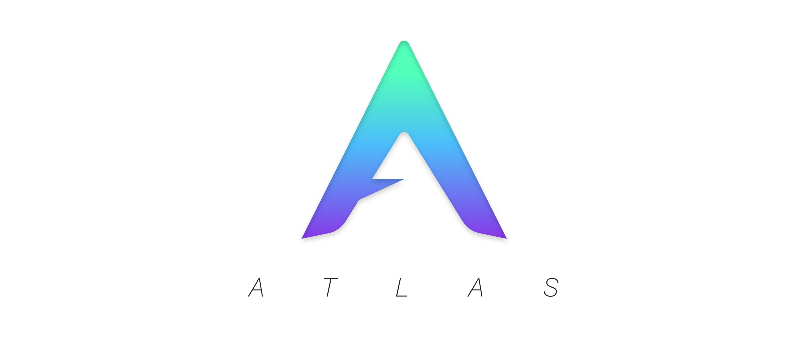

<div align='center'>

  <a href='https://github.com/nurodev/atlas/releases'>
    
  </a>

  [](http://www.gnu.org/licenses/) 
  [](https://gitmoji.carloscuesta.me/) 
  [](https://travis-ci.org/NuroDev/Atlas) 

  <br />
</div>

## Development

Clone:
```shell
git clone https://github.com/nurodev/atlas.git
cd atlas/
```

Build:
```shell
cargo build
```

Run:
```shell
cargo run --example sandbox
```

Docs:
```shell
cargo doc --no-deps --open
```

## Inspiration:

A lot of the architecture of Atlas and the way it functions was inspired by other existing Rust based game engines. These include:
 - [Amethyst](https://amethyst.rs/)
 - [Piston](https://piston.rs/)
 - [Kiss3D](http://kiss3d.org/)
 - [Veloren](https://gitlab.com/veloren/veloren)
 - [GGEZ](https://ggez.rs/)
 - [Coffee](https://github.com/hecrj/coffee) 
 
A **HUGE** thank you to all the contributors to all of those projects for their work that helped guide me in my creation of Atlas ❤️

## License

MIT © [Ben Dixon](https://github.com/NuroDev/atlas/blob/master/LICENSE)
