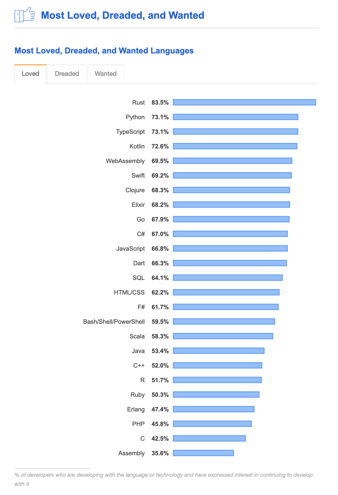

# 👋 Introduction
For the past nine years, I have been programming everything from simple projects using HTML to complex 3D games, and for
the past four years, I have been using C++ to do just that. Making games.
But as a programmer, there is always more to do, more to refine and more to improve on. From the first day that I started to use C++,
I realized it's real power and capabilities. However, that power very much comes at a cost.
That cost comes in the form of maintenance and ease of use. Maintaining an extensive C++ codebase or trying to get into using
C++ from any experience point is a challenge. For a language as widely used as C++, it should not be so cumbersome.

After spending my sandwich placement year out working in the industry, I had begun to use and enjoy the use of a new low-level 
programming language called Rust. This new language was only been around since 2015, but since then it has exploded in popularity
with developers. When Stack Overflow created its 2019 annual survey to show statistics from the past year, Rust was voted as the most loved language by developers.

<figure>
	
	<a href="https://insights.stackoverflow.com/survey/2019#most-loved-dreaded-and-wanted">
		<figcaption align='center'>Stack Overflow Developer Survey Results 2019: Most Loved, Dreaded, and Wanted</figcaption>
	</a>
</figure>

A lot of developers have come to like Rust over the past few years and after using it myself, I can see why.
It fixes a lot of the issues that C++ has plagued the industry for decades. Which left me wondering, how would Rust perform in the games industry?

To answer this, I tested Rust and pushed it to its limits to see if it is as powerful as it is as advertised.
Which leads me to the final question that this project is due to answer:

> As a development tool, how does Rust perform for games programming?

Throughout this report, I will be recording all plans, findings, practical work and result of my findings when I put Rust
up against C++ to see if it is comparable in performance to C++.
If the result show that it is proven to be a worthy competitor, are there are any advantages or disadvantages to using Rust over C++.
